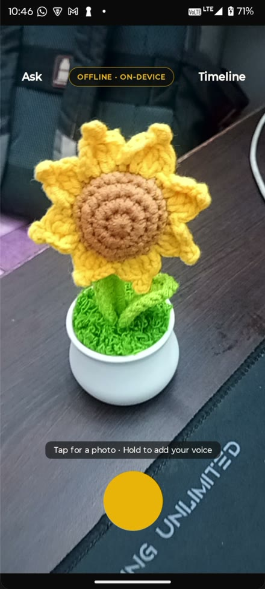

# Smriti

**Your phone remembers your work. Point the camera, say one line, ask it anything later.
Nothing ever leaves the device.**

<div align="center">

### ▶ [Watch the 2-minute demo](https://youtu.be/I66cuY9YyFk)

[](https://youtu.be/I66cuY9YyFk)

*Capture, structured extraction, timeline, and spoken recall with photo evidence —
running on a Moto G05.*

</div>

An offline camera-and-voice work log for people whose work does not happen at a desk — site
engineers, shop owners, lab technicians, field staff. You never type. Press once: the camera
captures the artefact in front of you and you say one line about it. On-device OCR reads the
image, on-device speech transcribes the voice, and a local language model fuses both into a
structured record. Later you ask, out loud, in plain language — and it answers with the original
photograph as evidence.

> **Provenance.** This repository is a reference implementation written outside the iQOO
> Hackathon 2026 event window. The competition requires all submitted code to be written during
> the event, so this repo is not submitted and is not linked from the Phase 1 form. The venue
> build starts from an empty directory.

---

## The one rule

**The shipping build has no `INTERNET` permission**, and that is enforced, not promised.

`:app:assertNoNetworkPermission` reads the *merged* manifest — the one that actually ships — and
fails the build if `INTERNET` or `ACCESS_NETWORK_STATE` appears. It exists because ML Kit pulls
in `com.google.android.datatransport:transport-backend-cct`, a telemetry uploader that declares
`INTERNET` in its own manifest, and the manifest merger added it to ours silently. The build was
green and the installed APK could open a socket.

The guard has been negative-tested: remove the `tools:node="remove"` lines and the build fails,
naming every offending entry.

## Two flavors

| | `offline` (default, ships) | `devcloud` (development only) |
|---|---|---|
| applicationId | `com.smriti.app` | `com.smriti.app.devcloud` |
| language model | Gemma 3 1B / Qwen2.5 via MediaPipe, on device | Muse Spark 1.2 via `api.meta.ai` |
| speech | Android `SpeechRecognizer` | Groq `whisper-large-v3-turbo` |
| `INTERNET` | **absent** | present |
| network guard | armed | skipped |

Different applicationIds, so both install side by side. Swapping back is a Gradle task, not a
code change — which is the point: `devcloud` exists because a generation takes 12–60 s on a
mid-range handset and prompt work at that speed is unworkable.

```bash
./gradlew assembleOfflineDebug     # ships. guard runs and must stay clean.
./gradlew assembleDevcloudDebug    # fast iteration. never released.
```

## Getting it running

```bash
source ~/Claude/iqoo-hackathon/env.sh     # JDK 21 + Android SDK
./scripts/verify-on-device.sh devcloud    # build, install, seed, self-test, screenshot
```

`verify-on-device.sh` audits the APK's permissions, refuses to continue if the offline flavor
ever gains `INTERNET`, seeds a demo corpus, runs the model end to end, and checks for crashes.

**Keys** go in `local.properties` (gitignored) and reach `devcloud` through BuildConfig:

```properties
museApiKey=...
groqApiKey=...
```

**For the offline flavor** a model must be pushed to the device:

```bash
adb shell mkdir -p /data/local/tmp/llm
adb push <model>.task /data/local/tmp/llm/
```

`ModelProvisioner` takes any `*.task` over 100 MB and prefers Gemma when several are present.
Gemma 3 1B is licence-gated on HuggingFace; `litert-community/Qwen2.5-0.5B-Instruct` is
Apache-2.0 and needs no acceptance.

## Architecture

```
camera ─→ ML Kit OCR (Latin + Devanagari) ─┐
                                           ├─→ LlmBackend ─→ structured record ─→ Room
mic ────→ Asr ─────────────────────────────┘                        │
                                                                     ↓
                          question ─→ Embedder ─→ cosine top-k ─→ answer + evidence photo
```

Both `LlmBackend` and `Asr` are interfaces chosen by a per-flavor factory. Everything else is
shared.

**Deliberate choices worth knowing:**

- **No vector database.** Brute-force cosine over a few hundred records is sub-millisecond.
  Revisit around 10k records.
- **OCR runs both recognizers and keeps whichever read more.** The Latin model returns
  near-empty text on Devanagari, and real Indian workplace paper is routinely bilingual.
- **The extractor never throws.** A 1B model does not honour schemas: brace-slicing, fence
  stripping, trailing-comma repair, key aliases (`actions` / `actionItems` / `action_items` /
  `tasks`), arrays of strings where objects were asked for, then one shortened retry, then a
  raw-transcript fallback. Losing a capture because the model rambled is the worst failure this
  app can have.
- **Unparseable dates become no date, never a wrong date.**
- **The GPU is quarantined after one unexplained death.** See below.

## Hard-won facts

Each of these cost real time. They are here so they cost it only once.

**MediaPipe's `Backend` enum is `DEFAULT | CPU | GPU`.** There is no NPU value — read from the
shipped AAR with `javap`, not from a blog. True Hexagon execution needs LiteRT-LM with an
AOT-compiled per-SoC model; Google publishes one for `sm8850`, the iQOO 15's silicon.

**The GPU backend segfaults on Mali.** It initialises, loads the model, then dies mid-generation
with `SIGSEGV` at `0x0` inside `libllm_inference_engine_jni.so`. A native crash takes the process
with it, so try/catch fallback is impossible. `BackendPolicy` writes a sentinel with `commit()`
before each attempt and quarantines the GPU permanently if a later launch finds it uncleared.

**Muse Spark's reasoning tokens count against `max_tokens`.** At 512 it spent 509 thinking,
returned `stop_reason: max_tokens` and an **empty content array with HTTP 200**. Silent success
returning nothing. `MuseBackend` requests 4× headroom and warns when text is empty.

**`content` from `api.meta.ai` is an array** mixing `redacted_thinking` and `text` entries.
Taking `content[0]` yields an empty string.

**Android's on-device speech recogniser may have no language pack.** Measured on a Moto G05 on
stock Android 15: `LANGUAGE_PACK_ERROR`, code 13, for `en-US`. It fails at
`onStartListening`, not at the gesture. **whisper.cpp is therefore a requirement for the offline
build, not a stretch goal.** `AsrFactory` in the offline source set is where that swap happens.

**Never run Homebrew's `gradle` on this project.** It is 9.7.x, and Gradle ≥ 9.6 removed an
internal API every AGP 8.x depends on. Use the wrapper. To create one, run `gradle wrapper` in a
throwaway empty directory and copy `gradlew` plus the wrapper jar across.

**MIUI blocks the first `adb install`** (`INSTALL_FAILED_USER_RESTRICTED`), including
`pm install` as the shell user, and denies `INJECT_EVENTS` so `adb shell input tap` does not
work. Push to `/sdcard/Download` and tap once; updates over `adb install -r` then work. Stock
Android has neither restriction.

## Tools

`tools/prompt_harness.py` iterates prompt templates against Gemini or Muse Spark on the laptop,
scoring with `tools/repair.py` — a Python port of the Kotlin lenient parser, and the reference
the Kotlin must match. Its lasting value is regression-testing the repair path against real
model outputs; see `tools/README.md` for why it is *not* the right tool for choosing a prompt
for a 1B model.

## State

See `PROGRESS.md` for the full chronological log, `ARCHITECTURE.md` for the build spec, and
`PITCH.md` for the three-minute demo script.
